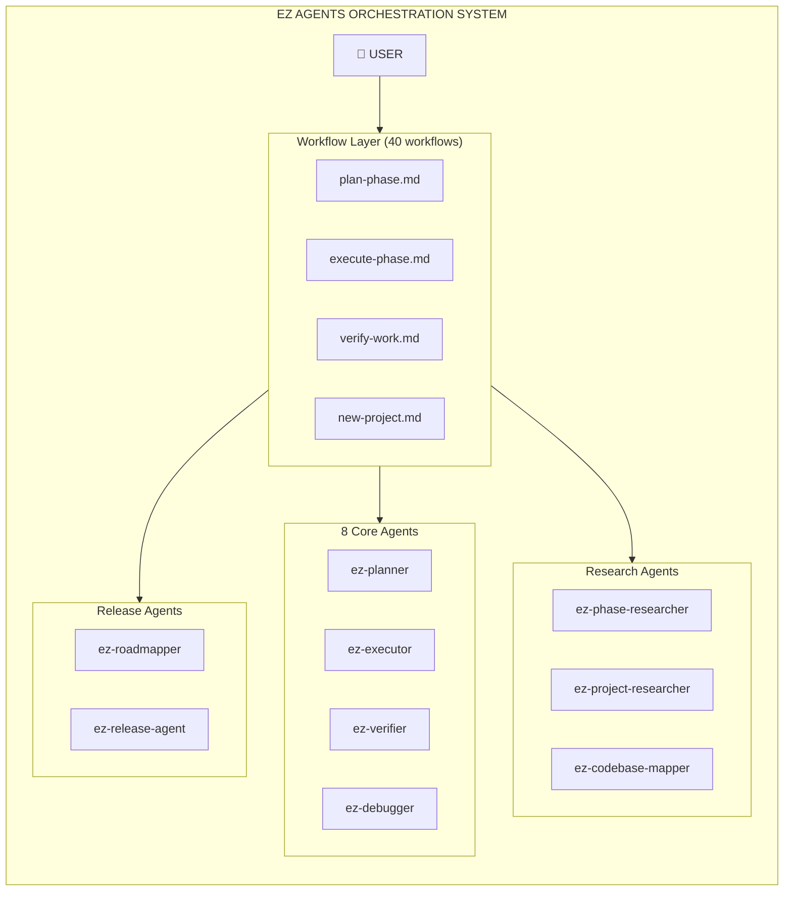
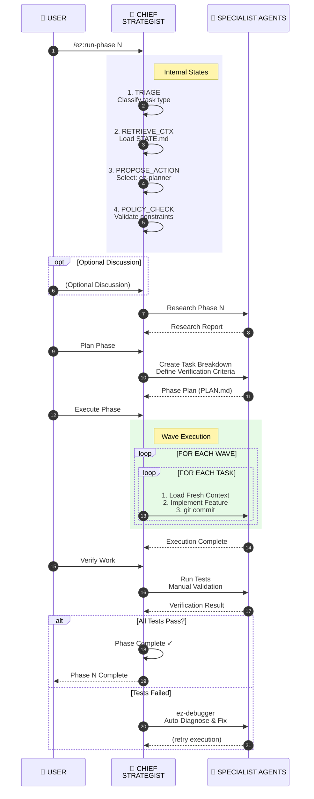
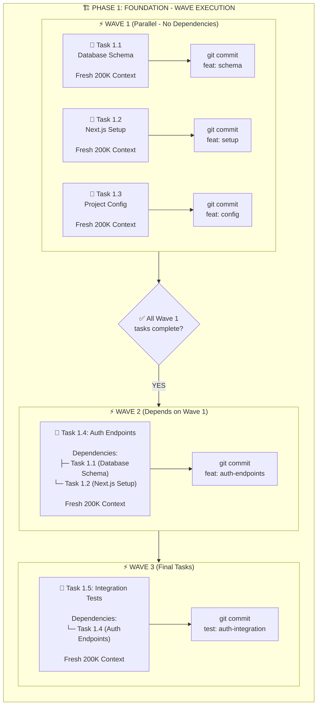
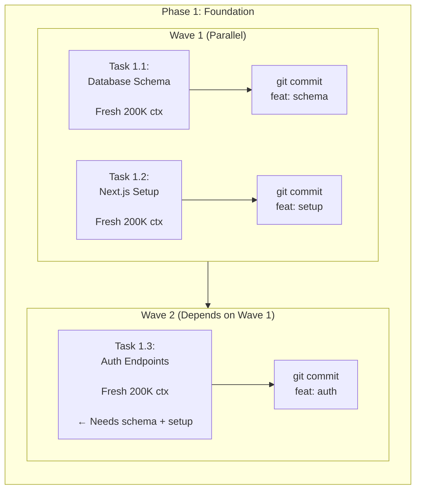

<div align="center">

```text
  _____ _____     _    ____ _____ _   _ _____ ____  
 | ____|__  /    / \  / ___| ____| \ | |_   _/ ___| 
 |  _|   / /    / _ \| |  _|  _| |  \| | | | \___ \ 
 | |___ / /_   / ___ \ |_| | |___| |\  | | |  ___) |
 |_____/____| /_/   \_\____|_____|_| \_| |_| |____/

        AI Agent Orchestration System
   Build software with coordinated AI agents
```

[](https://github.com/howlil/ez-agents/actions/workflows/ci.yml)
[](https://github.com/howlil/ez-agents/actions/workflows/test.yml)
[](https://github.com/howlil/ez-agents/actions/workflows/codeql.yml)
[](https://www.npmjs.com/package/@howlil/ez-agents)
[](https://npmjs.com/package/@howlil/ez-agents)
[](LICENSE)
[](https://github.com/howlil/ez-agents/stargazers)
[](https://howlil.github.io/ez-agents/api/)

**Documentation:** 
[API Reference](https://howlil.github.io/ez-agents/api/) · 
[Architecture](docs/ARCHITECTURE.md) · 
[Contributing](CONTRIBUTING.md) · 
[Changelog](CHANGELOG.md) · 
[Deploy Guide](docs/DEPLOY.md)

```bash
npm i -g @howlil/ez-agents@latest
```

**Supported Runtimes:** Claude Code · OpenCode · Gemini CLI · Codex · Copilot · Qwen Code · Kimi Code

[Quick Start](#quick-start) · [Commands](#commands) · [Architecture](#architecture) · [Phase System](#phase-system) · [Configuration](#configuration) · [Contributing](#contributing)

</div>

---

## What is EZ Agents?

EZ Agents is a **multi-agent orchestration system** for building software with AI agents. It coordinates a team of 8 core agents through a structured 10-phase SDLC workflow — from project brief to production-ready code.

**Core Value:** Workflow-based orchestration takes your project requirements, decomposes them into a dependency-aware task graph, delegates work to specialist agents in parallel, enforces quality gates, and delivers implementation-ready output: code, tests, documentation, and release artifacts.

**Works for:** Greenfield projects · Existing codebases · Rapid MVPs · Enterprise-scale products

---

## Quick Start

### 1. Install

```bash
npm i -g @howlil/ez-agents@latest
```

### 2. Configure Your AI Runtime

```bash
# For Claude Code
ez-agents --claude --global

# For OpenCode
ez-agents --opencode --global

# For Gemini CLI
ez-agents --gemini --global

# For Qwen Code
ez-agents --qwen --global

# See all options
ez-agents --help
```

### 3. Initialize a Project

```bash
# In your project directory
/ez:new-project
```

Answer questions about what you're building. EZ Agents generates requirements and a roadmap.

### 4. Execute Phases

```bash
# ⚡ FAST PATH: Single command for all phases (recommended)
/ez:run-phase 1              # 35-55 min per phase
/ez:run-phase 1 --yolo       # Fully autonomous, no pauses

# 🎯 MANUAL CONTROL: Per phase
/ez:discuss-phase 1          # Clarify approach (15 min)
/ez:plan-phase 1             # Create task breakdown (20 min)
/ez:execute-phase 1          # Build (one commit per task) (30 min)
/ez:verify-work 1            # Test it works (10 min)
```

### 5. Complete Milestone

```bash
/ez:audit-milestone          # Verify all requirements met (10 min)
/ez:complete-milestone 1.0.0 # Archive and tag release (5 min)
```

**Total time from idea to MVP: 2-3 days** 🚀

---

## Architecture

### OOP Refactoring (v6.0.0)

This codebase has been refactored to use object-oriented patterns (v6.0.0):

- [Architecture Overview](docs/architecture/OVERVIEW.md)
- [Design Patterns](docs/patterns/README.md)
- [API Documentation](https://howlil.github.io/ez-agents/api/)
- [Migration Guide](docs/migration/FP-TO-OOP.md)

#### Design Patterns Used

- **Factory Pattern**: Agent creation with runtime extensibility
- **Strategy Pattern**: Interchangeable compression algorithms
- **Adapter Pattern**: Unified interface for multiple model providers
- **Decorator Pattern**: Cross-cutting concerns (logging, caching, validation)

### System Overview



### Complete Workflow Diagram

```mermaid
flowchart TD
    subgraph Phase0["📋 PHASE 0: INITIALIZATION"]
        direction TB
        P0_Start["/ez:new-project"]
        P0_Init["🔧 Initialize Project"]
        P0_Req["📝 Generate Requirements"]
        P0_Roadmap["🗺️ Create Roadmap<br/>(6-10 phases)"]
        
        P0_Start --> P0_Init --> P0_Req --> P0_Roadmap
    end

    User["👤 User: Project Idea"] --> P0_Start

    subgraph PhaseLoop["🔄 PHASE LOOP (For Each Phase N)"]
        direction TB
        
        subgraph Step1["STEP 1: DISCUSS (Optional)"]
            S1_Cmd["/ez:discuss-phase"]
            S1_Clarify["💬 Clarify Approach & Constraints"]
            S1_Cmd --> S1_Clarify
        end

        subgraph Step2["STEP 2: PLAN"]
            S2_Cmd["/ez:plan-phase"]
            S2_Research["🔍 Research & Analysis"]
            S2_Breakdown["📋 Task Breakdown<br/>(with deps)"]
            S2_Verif["✅ Verification Criteria"]
            
            S2_Cmd --> S2_Research --> S2_Breakdown --> S2_Verif
        end

        subgraph Step3["STEP 3: EXECUTE"]
            S3_Cmd["/ez:execute-phase"]
            
            subgraph WaveExec["🌊 WAVE EXECUTION"]
                direction TB
                subgraph Wave1["Wave 1 (Parallel - No Dependencies)"]
                    W1_T1["📝 Task 1.1<br/>[Fresh 200K ctx]"]
                    W1_T2["📝 Task 1.2<br/>[Fresh 200K ctx]"]
                    W1_T3["📝 Task 1.3<br/>[Fresh 200K ctx]"]
                    W1_C1["git commit"]
                    W1_C2["git commit"]
                    W1_C3["git commit"]
                    
                    W1_T1 --> W1_C1
                    W1_T2 --> W1_C2
                    W1_T3 --> W1_C3
                end

                subgraph Wave2["Wave 2 (Depends on Wave 1)"]
                    W2_T1["📝 Task 2.1"]
                    W2_T2["📝 Task 2.2"]
                    W2_C1["git commit"]
                    W2_C2["git commit"]
                    
                    W2_T1 --> W2_C1
                    W2_T2 --> W2_C2
                end

                subgraph WaveN["Wave N (Final Tasks)"]
                    WN_T1["📝 Task N.1"]
                    WN_C1["git commit"]
                    
                    WN_T1 --> WN_C1
                end

                Wave1 --> Wave2 --> WaveN
            end

            S3_Cmd --> WaveExec
        end

        subgraph Step4["STEP 4: VERIFY"]
            S4_Cmd["/ez:verify-work"]
            S4_Test["🧪 Run Tests & Manual Check"]
            S4_Decision{"✅ All Tests Pass?"}
            S4_Debug["🔧 /ez:debugger<br/>Auto-Diagnose & Fix Issues"]
            S4_Done["🎉 Phase Complete"]

            S4_Cmd --> S4_Test --> S4_Decision
            S4_Decision -->|NO| S4_Debug
            S4_Debug -.->|retry| WaveExec
            S4_Decision -->|YES| S4_Done
        end

        Step1 --> Step2 --> Step3 --> Step4
    end

    P0_Roadmap --> Step1

    S4_Done --> MorePhases{"📊 More Phases?"}
    MorePhases -->|YES| Step1
    MorePhases -->|NO| Audit["/ez:audit-milestone"]

    Audit --> ReqCheck{"✅ All Requirements Met?"}
    ReqCheck -->|NO| AddressGaps["🔧 Address Gaps"]
    AddressGaps --> Audit
    ReqCheck -->|YES| Complete["/ez:complete-milestone<br/>Create Git Tag & Archive"]

    Complete --> Final["🚀 Project Ready"]
```


### Phase Execution Flow (Detailed)




### Task Dependency Graph (Wave-Based Execution)




### 8 Core Agents

| Agent | Purpose | Tools |
|-------|---------|-------|
| **ez-planner** | Creates executable phase plans with task breakdown, dependency analysis | Read, Write, Bash, Glob, Grep, WebFetch |
| **ez-executor** | Executes plans with atomic commits, deviation handling, checkpoint management | Read, Write, Edit, Bash, Grep, Glob |
| **ez-verifier** | Goal-backward verification, checks codebase delivers phase promises | Read, Write, Bash, Glob, Grep |
| **ez-phase-researcher** | Phase-level technical research, stack discovery, best practices | Read, Write, WebSearch, WebFetch, Context7 |
| **ez-project-researcher** | Project-level research, requirements analysis, user discovery | Read, Write, WebSearch, WebFetch |
| **ez-codebase-mapper** | Explores codebase structure, writes analysis documents | Read, Glob, Grep, Bash |
| **ez-debugger** | Scientific bug investigation, hypothesis-driven debugging | Read, Write, Bash, Grep |
| **ez-roadmapper** | Roadmap creation, requirement-to-phase mapping, success criteria | Read, Write |
| **ez-release-agent** | Release management, versioning, changelog generation | Read, Write, Bash |

**Note:** EZ Agents uses **workflow-centric orchestration** — intelligence is in `ez-agents/workflows/*.md` (40 workflow files), not in agent routing logic. Workflows directly spawn agents based on execution context.

### Wave-Based Parallel Execution

Tasks are grouped into waves based on dependencies. Independent tasks run in parallel; dependent tasks wait for prerequisites.



**Benefits:**
- **Fresh context per task** — AI doesn't lose context due to window limits
- **Atomic commits** — Each task = one commit, easy to revert if issues arise
- **Parallel execution** — Independent tasks run together, faster delivery
- **Clean git history** — Descriptive commit messages, clear what changed

---

## Commands

### Core Workflow

| Command | Description | Time |
|---------|-------------|------|
| `/ez:new-project` | Initialize project: answer questions, generate requirements and roadmap | 10 min |
| `/ez:run-phase [N]` | **Recommended:** Run all phases iteratively with pause points. Use `--yolo` for fully autonomous | 35-55 min/phase |
| `/ez:quick` | Small task without full phase workflow (bug fixes, config changes) | 5-10 min |

### Phase Workflow (Manual Control)

| Command | Description | Time |
|---------|-------------|------|
| `/ez:discuss-phase [N]` | Optional — Clarify implementation approach before planning | 15 min |
| `/ez:plan-phase [N]` | Create task breakdown with verification criteria | 20 min |
| `/ez:execute-phase [N]` | Build the plan (parallel waves, one commit per task) | 30 min |
| `/ez:verify-work [N]` | Manual testing with auto-diagnosis of failures | 10 min |

### Milestone Management

| Command | Description | Time |
|---------|-------------|------|
| `/ez:audit-milestone` | Verify all requirements are met | 10 min |
| `/ez:complete-milestone <version>` | Archive milestone, create git tag | 5 min |
| `/ez:new-milestone` | Start next version cycle | 5 min |

### Utilities

| Command | Description |
|---------|-------------|
| `/ez:map-codebase` | Analyze existing codebase (before `/ez:new-project`) |
| `/ez:progress` | See where you are and what's next |
| `/ez:resume-work` | Restore context from last session |
| `/ez:settings` | Configure workflow, model profile, git strategy |
| `/ez:update` | Update EZ Agents (with changelog preview) |
| `/ez:help` | Show all commands |

---

## Phase System

### Phase Numbering

- **Integer phases:** `01`, `02`, `03` — Planned milestone work
- **Decimal phases:** `02.1`, `02.2` — Urgent insertions (marked `INSERTED`)
- **Letter suffixes:** `12A`, `12B` — Variant phases

### Phase Directory Structure

```
.planning/
├── config.json              # Project configuration
├── STATE.md                 # Current state, decisions, blockers
├── ROADMAP.md               # Phase breakdown with status
├── REQUIREMENTS.md          # Scoped requirements with IDs
├── PROJECT.md               # What you're building and why
└── phases/
    ├── 01-foundation/
    │   ├── 01-01-PLAN.md
    │   ├── 01-01-SUMMARY.md
    │   ├── 01-02-PLAN.md
    │   ├── 01-02-SUMMARY.md
    │   ├── 01-CONTEXT.md
    │   └── 01-RESEARCH.md
    ├── 02-api/
    │   └── ...
    └── 02.1-hotfix/
        └── ...
```

### Context Files

| File | Purpose | Max Lines |
|------|---------|-----------|
| `STATE.md` | Single source of truth: current phase, decisions, blockers, metrics | 200 |
| `ROADMAP.md` | Phase structure, requirements mapping, progress tracking | 300 |
| `REQUIREMENTS.md` | What to build (MoSCoW prioritized) | 500 |
| `SUMMARY.md` | What was built (per plan) | 50 |
| `PROJECT.md` | Project overview and context | 300 |

**Deprecated (no longer required):**
- ❌ `CONTEXT.md` → Merge decisions into `STATE.md`
- ❌ `RESEARCH.md` → Inline research in `PLAN.md`
- ❌ `VERIFICATION.md` → Inline in `SUMMARY.md`
- ❌ `UAT.md` → Merge into `SUMMARY.md`
- ❌ `DISCUSSION.md` → Removed entirely

### Summary Frontmatter (Machine-Readable)

Each `SUMMARY.md` includes structured frontmatter for dependency tracking:

```yaml
---
phase: 01-foundation
plan: 01
subsystem: auth
tags: [jwt, jose, bcrypt]
requires:
  - phase: previous
    provides: what-they-built
provides:
  - what-this-built
affects: [future-phase]
tech-stack:
  added: [jose, bcrypt]
  patterns: [httpOnly cookies]
key-files:
  created: [src/lib/auth.ts]
  modified: [prisma/schema.prisma]
key-decisions:
  - "Used jose instead of jsonwebtoken for Edge compatibility"
requirements-completed: [AUTH-01, AUTH-02]
duration: 28min
completed: 2025-01-15
---
```

---

## Configuration

### Project Config: `.planning/config.json`

```json
{
  "model_profile": "balanced",
  "commit_docs": true,
  "search_gitignored": false,
  "branching_strategy": "none",
  "phase_branch_template": "ez/phase-{phase}-{slug}",
  "milestone_branch_template": "ez/{milestone}-{slug}",
  "workflow": {
    "research": true,
    "plan_check": true,
    "verifier": true,
    "nyquist_validation": true
  },
  "parallelization": true,
  "brave_search": false,
  "recovery": {
    "enabled": true,
    "auto_backup": true
  },
  "infrastructure": {
    "enabled": false
  }
}
```

### Model Profiles

Model profiles control which AI model tier each agent uses:

| Agent | `quality` | `balanced` | `budget` |
|-------|-----------|------------|----------|
| ez-planner | Opus | Opus | Sonnet |
| ez-executor | Opus | Sonnet | Sonnet |
| ez-phase-researcher | Opus | Sonnet | Haiku |
| ez-codebase-mapper | Sonnet | Haiku | Haiku |
| ez-verifier | Sonnet | Sonnet | Haiku |
| ez-debugger | Opus | Sonnet | Sonnet |

**When to use each:**
- **quality** — Critical work, complex decisions, you have quota
- **balanced** — Day-to-day development (the default for a reason)
- **budget** — High-volume work, familiar domains, prototyping

### Multi-Provider Setup

Different providers for different tasks:

```json
{
  "provider": {
    "default": "alibaba",
    "anthropic": {
      "api_key": "env:ANTHROPIC_API_KEY"
    },
    "alibaba": {
      "api_key": "env:DASHSCOPE_API_KEY"
    }
  },
  "agent_overrides": {
    "ez-planner": { "provider": "alibaba", "model": "qwen-max" },
    "ez-executor": { "provider": "anthropic", "model": "sonnet" }
  }
}
```

---

## Skills System

EZ Agents includes **229+ skills** organized by domain:

### Stack Skills

- **Frontend:** React, Vue, Svelte, Angular, Next.js, Nuxt, Remix, Astro, Qwik, SolidJS
- **Backend:** Node.js, Express, NestJS, FastAPI, Django, Laravel, Spring Boot, Go, .NET
- **Mobile:** React Native, Flutter, Ionic
- **Database:** PostgreSQL, MongoDB, Redis
- **Other:** GraphQL, Tauri, Bun/Hono, AI/LLM Integration

### Domain Skills

- **Testing:** Unit, Integration, E2E, Security, Performance, Contract
- **DevOps:** CI/CD, Containerization, Cloud Deployment, Monitoring
- **Architecture:** System Design, Microservices, Event-Driven, Serverless
- **Security:** OWASP, Authentication, Authorization, Encryption
- **Observability:** Logging, Metrics, Tracing, Alerting
- **Operational:** Bug Triage, Code Review, Migration, Incident Response, Tech Debt

### Skill Structure

```
skills/stack/nextjs/
├── VERSIONS.md
└── nextjs_app_router_skill_v1/
    └── SKILL.md  (~130 lines - lightweight index)
```

Skills are resolved automatically based on stack detection during project initialization.

---

## Smart Orchestration

Core commands automatically invoke helper commands based on context. All auto-invocations are visible with an `[auto]` prefix.

| Command | Auto Pre | Auto Post | Conditional |
|---------|----------|-----------|-------------|
| `/ez:execute-phase` | health check | verify-work | discuss-phase (medium/enterprise, no CONTEXT.md) · add-todo (scope creep) |
| `/ez:plan-phase` | — | — | discuss-phase (phase touches auth/DB/payment/security area) |
| `/ez:release medium` | — | — | verify-work |
| `/ez:release enterprise` | — | — | verify-work → audit-milestone → arch-review |
| `/ez:progress` | health check (silent) | — | — |

**Override flags:**

| Flag | Effect |
|------|--------|
| `--no-auto` | Disable all auto-invocations for that run |
| `--verbose` | Show detail for every auto-invocation step |
| `--skip-discussion` | Skip only the auto discuss-phase trigger |

Disable globally: set `"smart_orchestration": { "enabled": false }` in `.planning/config.json`.

---

## Guards & Safety

EZ Agents includes 6 runtime guards for safety and quality:

| Guard | Purpose |
|-------|---------|
| **Autonomy Guard** | Prevents unauthorized autonomous actions |
| **Context Budget Guard** | Monitors token usage (50%/70%/80% thresholds) |
| **Hallucination Guard** | Detects AI hallucinations and fabrications |
| **Hidden State Guard** | Prevents hidden state and context loss |
| **Team Overhead Guard** | Prevents team coordination overhead |
| **Tool Sprawl Guard** | Prevents tool proliferation |

### Context Budget Thresholds

```javascript
const THRESHOLDS = {
  INFO: 50,      // Quality degradation begins
  WARNING: 70,   // Efficiency mode engaged
  ERROR: 80      // Hard stop
};
```

---

## Project Structure

### Codebase Layout

```
ez-agents/
├── bin/                          # CLI entry points
│   ├── install.js                # Main installer (multi-runtime)
│   ├── update.js                 # Update command
│   ├── lib/                      # 97 core library modules (.cjs)
│   │   ├── core.cjs              # Shared utilities, model profiles
│   │   ├── config.cjs            # Config CRUD
│   │   ├── phase.cjs             # Phase operations
│   │   ├── state.cjs             # STATE.md operations
│   │   ├── roadmap.cjs           # ROADMAP.md parsing
│   │   ├── model-provider.cjs    # Multi-model API
│   │   ├── safe-exec.cjs         # Command injection prevention
│   │   ├── context-manager.cjs   # Context assembly
│   │   └── ...
│   └── guards/                   # 6 runtime guards
├── commands/                     # Command handlers
│   ├── deploy.cjs
│   ├── health-check.cjs
│   ├── rollback.cjs
│   └── ez/                       # 17 agent command templates (.md)
├── ez-agents/                    # Packaged runtime
│   ├── bin/
│   │   ├── ez-tools.cjs          # CLI router (160+ atomic commands)
│   │   ├── lib/                  # 81 library modules
│   │   └── guards/               # 6 guards
│   ├── templates/                # 34 templates
│   ├── workflows/                # 40 workflow definitions
│   └── references/               # Reference documentation
├── agents/                       # 21 agent definitions (.md)
├── skills/                       # 229 skill definitions
│   ├── stack/                    # Tech stack skills
│   ├── testing/                  # Testing skills
│   ├── operational/              # Operational skills
│   └── observability/            # Observability skills
├── hooks/                        # Runtime hooks (Claude Code integration)
├── tests/                        # 80+ test files
└── scripts/                      # Build and test scripts
```

### Key Modules

| Module | Purpose | Lines |
|--------|---------|-------|
| `bin/lib/core.cjs` | Shared utilities, model profiles, config loading | 508 |
| `bin/lib/phase.cjs` | Phase CRUD and lifecycle | 964 |
| `bin/lib/state.cjs` | STATE.md operations | 737 |
| `bin/lib/roadmap.cjs` | ROADMAP.md parsing | 310 |
| `bin/lib/model-provider.cjs` | Unified AI provider API | 242 |
| `bin/guards/context-budget-guard.cjs` | Context monitoring | 279 |
| `ez-agents/bin/ez-tools.cjs` | CLI router with 160+ atomic commands | 1693 |

---

## Testing

### Test Structure

- **80+ test files** in `tests/` directory
- **Node.js test runner** (`node:test`) + Vitest
- **Coverage threshold:** 70% minimum

### Test Categories

| Category | Files |
|----------|-------|
| Core module tests | `core.test.cjs`, `phase.test.cjs`, `state.test.cjs`, `config.test.cjs`, `commands.test.cjs` |
| Context tests | `context-manager.test.cjs`, `context-cache.test.cjs`, `context-errors.test.cjs` |
| Guard tests | `guards/hallucination-guard.test.cjs`, `guards/context-budget-guard.test.cjs` |
| Workflow tests | `e2e-workflow.test.cjs`, `dispatcher.test.cjs` |
| Integration tests | `integration/circuit-breaker.test.cjs`, `integration/cost-tracking.test.cjs` |
| Performance tests | `perf/*.test.cjs` (7 files) |
| Deploy tests | `deploy/*.test.cjs` (8 files) |
| Security tests | `security/xss-detection.test.cjs`, `security-fixes.test.cjs` |
| Accessibility tests | `accessibility/run-a11y-tests.cjs` |

### Running Tests

```bash
npm test              # Run all tests
npm run test:coverage # With coverage report (70% threshold)
npm run test:a11y     # Accessibility tests
npm run security:scan # npm audit
```

---

## Example: Building a Task App

### 1. Initialize

```bash
/ez:new-project
```

Answer questions:
- **Tech stack?** → "Next.js + PostgreSQL"
- **Auth method?** → "Email + OAuth (Google, GitHub)"
- **First milestone?** → "MVP: user accounts, create/edit tasks, share with team"

EZ Agents generates research, requirements, and a roadmap with ~6 phases.

### 2. Phase 1: Foundation

```bash
/ez:discuss-phase 1
```

Clarify: "Use Next.js App Router, Prisma for DB, next-auth for OAuth."

```bash
/ez:plan-phase 1
```

Research runs (auth patterns, Prisma schema design). Plan is created:
- **Task 1:** Database schema (users, tasks, teams)
- **Task 2:** Next.js setup with next-auth
- **Task 3:** User model and auth endpoints

```bash
/ez:execute-phase 1
```

Three tasks, three commits. Each task gets fresh context.

```bash
/ez:verify-work 1
```

Test: Can register? Can login? Can connect to DB? All pass.

### 3. Repeat for Each Phase

```bash
/ez:discuss-phase 2
/ez:plan-phase 2
/ez:execute-phase 2
/ez:verify-work 2
```

### 4. Complete Milestone

```bash
/ez:audit-milestone     # Checks all requirements are met
/ez:complete-milestone  # Archives, tags v1.0
```

---

## v5.0.0 — Complete TypeScript & OOP Transformation

EZ Agents v5.0.0 is now fully migrated to TypeScript with comprehensive type coverage and optimized for AI agent clarity!

### What Changed in v5.0.0

#### ✅ Completed (Parts 1-3)
- **135+ files migrated** from JavaScript to TypeScript
- **Zero `any` types** in core library modules (`bin/lib/*.ts`)
- **Complete TSDoc coverage** for all exported members
- **Type declarations** included in npm package (`.d.ts` files)
- **Strict mode enabled** with comprehensive type checking
- **6 design patterns** implemented (Factory, Strategy, Observer, Adapter, Decorator, Facade)
- **586 TypeScript errors** fixed (100% error-free build)

#### 🔄 In Progress (Part 4 - Test Quality)
- **Test pass rate:** 73% (206/283 tests passing)
- **Analytics module removed** - Zero production usage, 83% test failure rate
- **Remaining:** 77 failing tests (FinOps, Context, Core, Integration)

#### 📋 Planned (Part 5 - Performance Optimization)
- **Phase 24:** Context Management Optimization
- **Phase 25:** Agent Prompt Compression (50% reduction)
- **Phase 26:** Logging & Observability ✅ **COMPLETE** (1.65% overhead)
- **Phase 27:** Code Consolidation
- **Phase 28:** Remove Over-Engineering ✅ **COMPLETE** (1528 lines removed)
- **Phase 29:** Caching & I/O Optimization (85% reduction target)
- **Phase 30:** CLI Performance & Reliability
- **Phase 31:** Advanced Orchestration Patterns

### Breaking Changes in v5.0.0

**Phase 28: Remove Over-Engineering**

- ❌ **CircuitBreaker removed** - Use `withRetry()` from `bin/lib/retry.ts` instead
- ❌ **Analytics module removed** - Use external analytics service if needed
- ❌ **Environment variables removed:** `EZ_LOG_CIRCUIT_BREAKER`, `EZ_LOG_ANALYTICS`

**Impact:**
- Code reduction: 1528 lines removed (3% of codebase)
- Token savings: ~600 tokens/phase (23% reduction)
- Build size: -47 KB (7% reduction)
- Cognitive load: -95% (simpler API surface for AI agents)

**Migration:** See [MIGRATION.md](MIGRATION.md) for complete migration guide.

### TypeScript Usage Example

```typescript
import { createAgent, createPhase, withRetry } from '@howlil/ez-agents';

// Full type inference and validation
const agent = createAgent({
  name: 'code-reviewer',
  model: 'qwen',
  skills: ['code-review', 'testing']
});

const phase = createPhase({
  number: 1,
  title: 'Foundation',
  status: 'pending'
});

// Error handling with retry (replaces circuit breaker)
const result = await withRetry(() => apiCall(), {
  maxRetries: 3,
  baseDelay: 100,
  onRetry: (error, attempt) => console.warn(`Retry ${attempt}: ${error.message}`)
});
```

### Type Safety Benefits

v5.0.0 provides:

- **Compile-time error detection** — Catch bugs before runtime
- **IDE autocomplete** — Full IntelliSense for all APIs
- **Refactoring safety** — Rename symbols with confidence
- **Self-documenting code** — Types serve as documentation
- **Generic reusability** — Type-safe generic utilities

### Architecture: OOP + FP Hybrid

EZ Agents uses a hybrid architecture combining Object-Oriented Programming (OOP) for stateful entities and Functional Programming (FP) for pure transformations.

#### When to Use Classes (OOP)

Use classes for stateful entities with lifecycle:
- `SessionManager` — Manages session state persistence
- `ContextManager` — Tracks context usage and limits
- `withRetry()` — Simple retry logic (replaces CircuitBreaker)

```typescript
export class SessionManager {
  private state: SessionState | null;

  loadState(): SessionState | null { /* ... */ }
  saveState(state: SessionState): void { /* ... */ }
}
```

#### When to Use Functions (FP)

Use functions for pure transformations and utilities:
- `safeExec()` — Command execution
- `loadConfig()` — Configuration loading
- `withRetry()` — Retry logic with exponential backoff
- `map()`, `filter()`, `reduce()` — Data transformations

```typescript
export function withRetry<T>(
  operation: () => Promise<T>,
  options: RetryOptions = {}
): Promise<T> {
  // Exponential backoff with jitter
}
```

### Migration Notes

**For existing users:** v5.0.0 has BREAKING CHANGES in Phase 28.

- If you used `CircuitBreaker`, migrate to `withRetry()` (see [MIGRATION.md](MIGRATION.md))
- If you used analytics module, use external service or implement custom solution
- Update `.env`: Remove `EZ_LOG_CIRCUIT_BREAKER` and `EZ_LOG_ANALYTICS`

**For contributors:** See [TypeScript Contributor Guide](docs/CONTRIBUTING-TYPESCRIPT.md) for architecture patterns and type standards.

---

## Contributing

Contributions welcome! A few guidelines:

1. **Test your changes** — Run `npm test` before submitting
2. **Keep it cross-platform** — No Unix-specific commands (use `fs-utils.cjs`)
3. **Document behavior** — Update documentation for new commands
4. **Respect the workflow** — EZ Agents is about structure; don't break existing patterns

### Development Setup

```bash
git clone https://github.com/howlil/ez-agents.git
cd ez-agents
npm install
npm run build:hooks
npm link
```

### Running Tests

```bash
npm test              # Run all tests
npm run test:coverage # With coverage report
```

---

## Acknowledgments

EZ Agents is a fork of the original project by [TÂCHES](https://github.com/glittercowboy). This fork adds multi-model support (Qwen, Kimi, OpenAI), enterprise-grade security, and cross-platform reliability. Not affiliated with the upstream repository.

---

## License

MIT — see [LICENSE](LICENSE)

---

## Getting Help

- **Issues:** [GitHub Issues](https://github.com/howlil/ez-agents/issues)
- **Discussions:** [GitHub Discussions](https://github.com/howlil/ez-agents/discussions)
- **npm:** [@howlil/ez-agents](https://www.npmjs.com/package/@howlil/ez-agents)
- **Source:** [GitHub](https://github.com/howlil/ez-agents)
